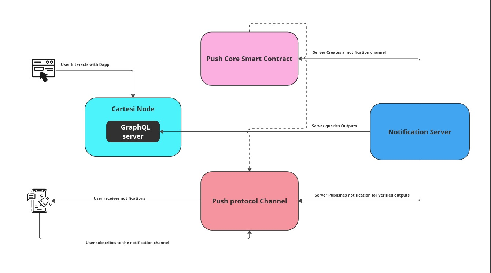

# Cartesi Push Notification Server

A basic server which allows DApp creators to provide push notifications of verified Outputs to users. This service plays a crucial role in creating fully interactive Cartesi DApps where the user doesn't need to worry about epoch finalization for verified outputs. The problem becomes glaringly evident when dealing with onchain assets where the user needs to execute a voucher after the epoch is finalized. This service can be very useful to provide an user with notification about unexecuted vouchers for withdrawal of assets.

## Architecture



## Instructions

### Create a push notification Channel

[Official Push protocol Guide](https://push.org/docs/notifications/tutorials/create-your-channel/)

### Run

```
cp .env.sample .env

node index.js
```

## Demo Video

[Demo](https://drive.google.com/file/d/1SMYO2iX_7bSkXnzVKOPayLWd8o4XK2VG/view?usp=sharing)
